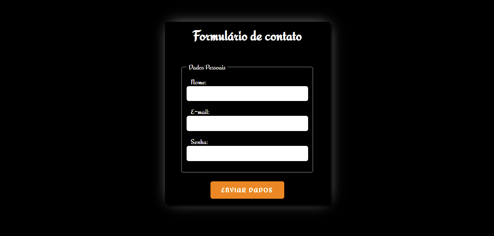
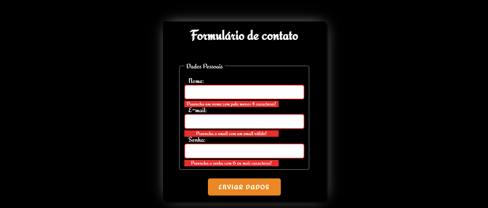

# Validação de Formulário com JavaScript

### Screenshot

### Links

- Solução URL: https://danimichelydev.github.io/form-validation-Js/

## 

### Construído com

- HTML5

- CSS3

- Flexbox

- Mobile-first

- JavaScript

- Regex

  

### Autora

- Github - https://github.com/danimichelydev
- Linkedin: https://www.linkedin.com/in/dani-michely/

